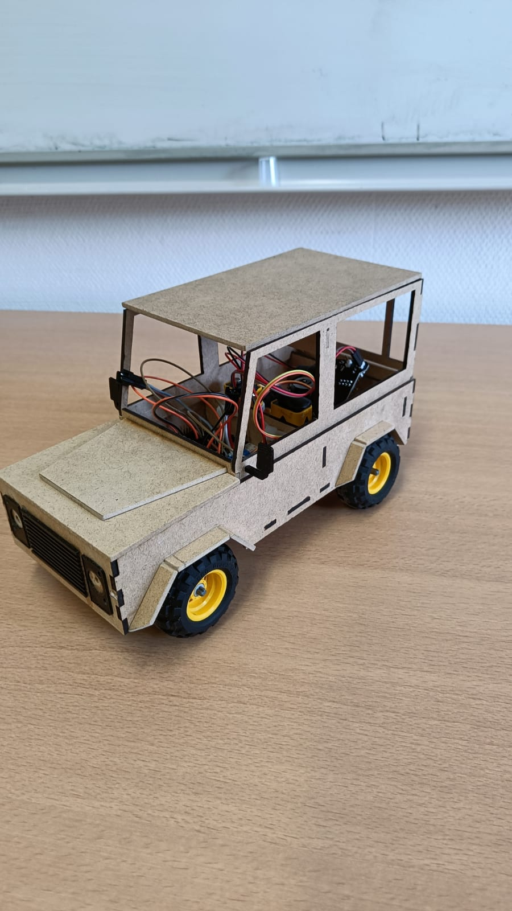

Es ist Freitag, der 24.02.2023. Die Nerven liegen blank. Letzte Fixes und Vorbereitungen werden getroffen, bevor die Ausstellung startet.
Über das Semester sind viele Stunden in das Projekt geflossen, um am Ende ein funktionierendes „Auto“ vorstellen zu können. Dies hat auch relativ gut funktioniert, worauf ich stolz bin (auch wenn nach dem ersten Zusammenstoß die Achse schlapp gemacht hat).

Von den Besuchern kam ebenfalls das Lob dafür, dass mein Projekt die wichtigste Eigenschaft eines Autos beherrsche.
Während der Präsentation habe ich aber immer versucht, nicht auf Jakobs Auto zu schauen. Im Vergleich war meins schon ziemlich schei*e.
Aber dadurch habe ich gesehen, was durch gute Planung und Zeitinvestition möglich ist, und das hat mich motiviert, die Dinge nächstes Semester anders anzugehen!

Das Semester hat mir die Grundlagen der 3D-Modellierung, Lasercutten und vor allem Löten beigebracht.
Ich habe immer noch das Gefühl nicht vieles gut hinzubekommen, aber immerhin so, dass es am Ende funktioniert, und das konnte ich vor diesem Semester nicht.

Insgesamt war das bislang das interessanteste und hilfreichste Fach, welches ich belegt habe. Die Kombination aus Theorie und sehr viel Praxis macht einfach Bock!
Ebenso bin ich der Meinung, dass eine zum Abschluss eine Messe deutlich sinnvoller ist, als stupide Präsentationen runterzurattern. Das macht für die Studenten als auch Besucher mehr Spaß.
Der einzige Kritikpunkt liegt darin, dass der Punkt des Lötens nie zu mir durchgedrungen ist. Erst am vorletzten Tag habe ich mitbekommen, dass die Teile auf eine Platine gelötet werden müssen.
Deshalb wäre für das erste Semester eine grobe Liste mit den wichtigsten Schritten, an welcher man sich entlang hangeln kann, sinnvoll.

Ideen für das nächste Semester fehlen mir noch, aber ich halte die Augen offen.