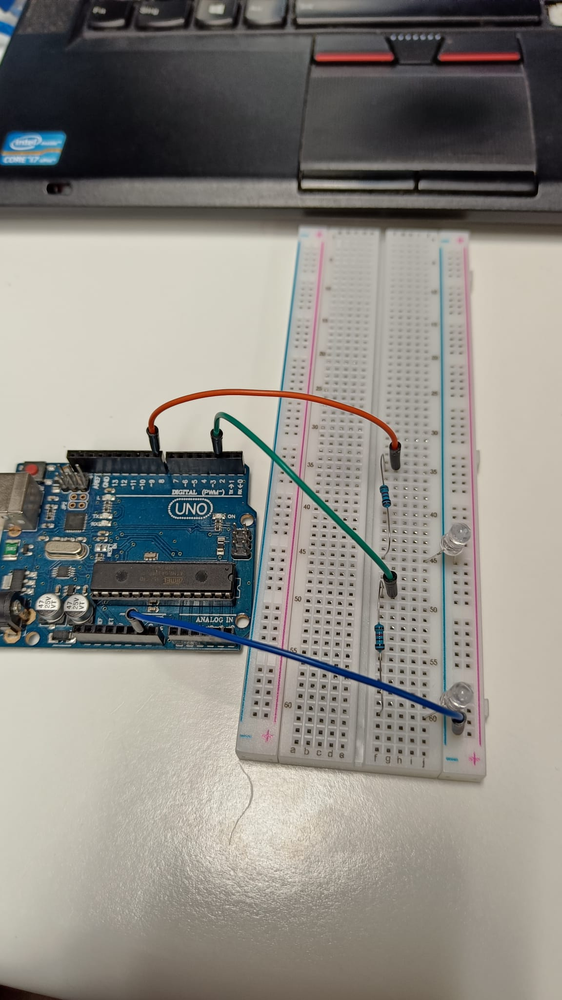

# Die ersten LEDs

Bevor wir damit anfiengen eigene LEDs zum leuchten zu bringen, haben wir mit dem vorgefertigten Beispielen, zwei LEDs auf dem Board zum blinken zu bringen. Das hat ohne Probleme funktioniert, weshalb wir direkt dazu übergegangen sind unsere eigenen LEDs anzuschließen und leuchten zu lassen.
Anfangs war ich noch verwirrt wie und mit was die Pole angeschlossen werden müssen, aber nach einiger Zeit hat man ein Gefühl und auch das Verständnis dafür bekommen, wie es richtig ist.


Danach habe ich mir mit einer 8 Segment Uhr schon eine größere Herausforderung gesucht. Hierbei habe ich das erste mal eine Library verwendet(fragt nicht welche). Damit war es deutlich leichter, da nicht jedes Segment einzeln eingesteckt werden muss.
Zu beachten ist, dass wirklich jedes Kabel an der richtigen Stelle steckt. Das ist wriklich sehr wichtig wie ich festegestllt habe.


Danach habe ich auch schon mit den ersten Problemen zu meinem Projekt beschäftigt. Dafür habe ich einen Schrittmotor mit einem Joystick angesteuert. Ziel war es, dass wenn der Stick nach links bewegt, soll sich der Motor in die eine Richtung drehen und wenn der Stick nach richts bewegt wird, dreht sich der Motor in die andere Richtung.


Die Logik hinter der Steuerung ist ziemlich simpel. Zu Beginn der loop Funktion fragen wir nach der Position des Joysticks. Sobald der Joystick einen gewissen Wert überschreitet(523) oder unterschreitet(23), springen wir in eine While-loop, welche den Motor bewegt. Damit wir nicht für alle Ewigkeiten in der While-loop gefangen sind, fragen wir mit jedem Durchlauf ab, welche Position der Stick hat.

```c
void loop() {
    joystick = analogRead(A0);
    while(joystick >= 523){
        stepper.step(1);
        joystick = analogRead(A0);
    }
    while(joystick <= 23){
        stepper.step(-1);
        joystick = analogRead(A0); 
    }
}
```

Ich bin der Meinung, dass ich Steuerungsweise jetzt schon alles umsetzen kann, was ich für den Battlebot brauche. Aber nicht, wenn ich das ganze Kabellose ansteuern möchte. Hierfür muss ich noch überlegen, wie ich den Bot kabellos ansteurn möchte. 