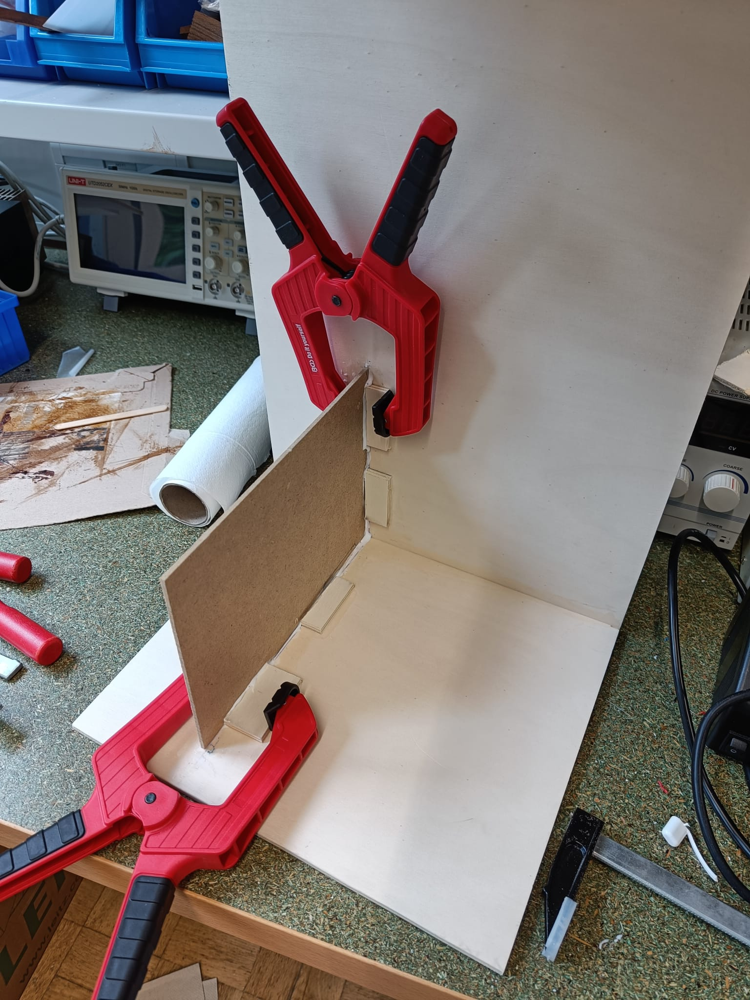
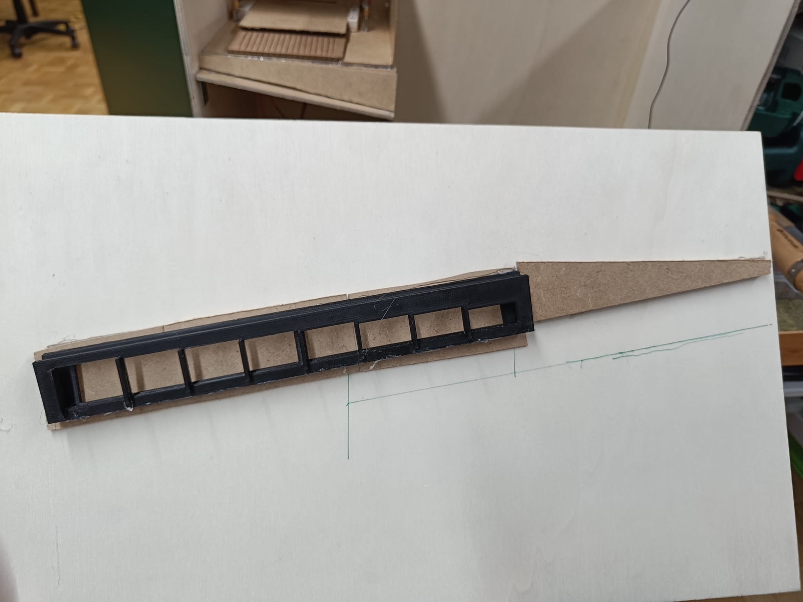
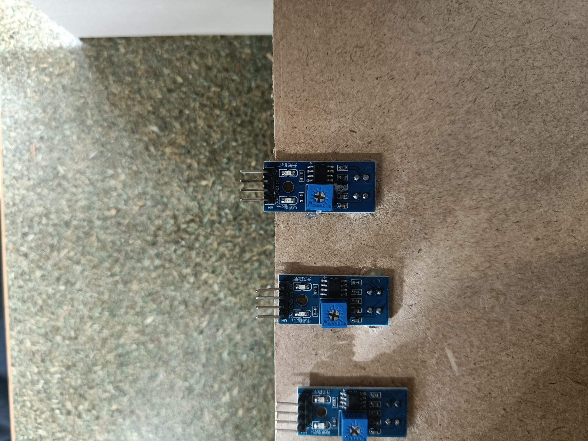
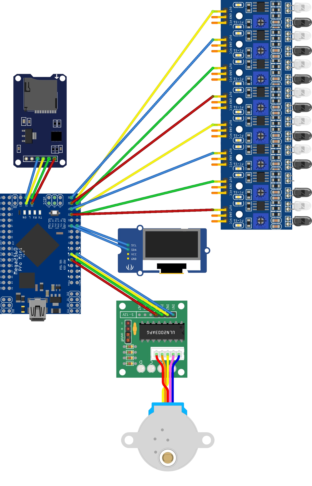
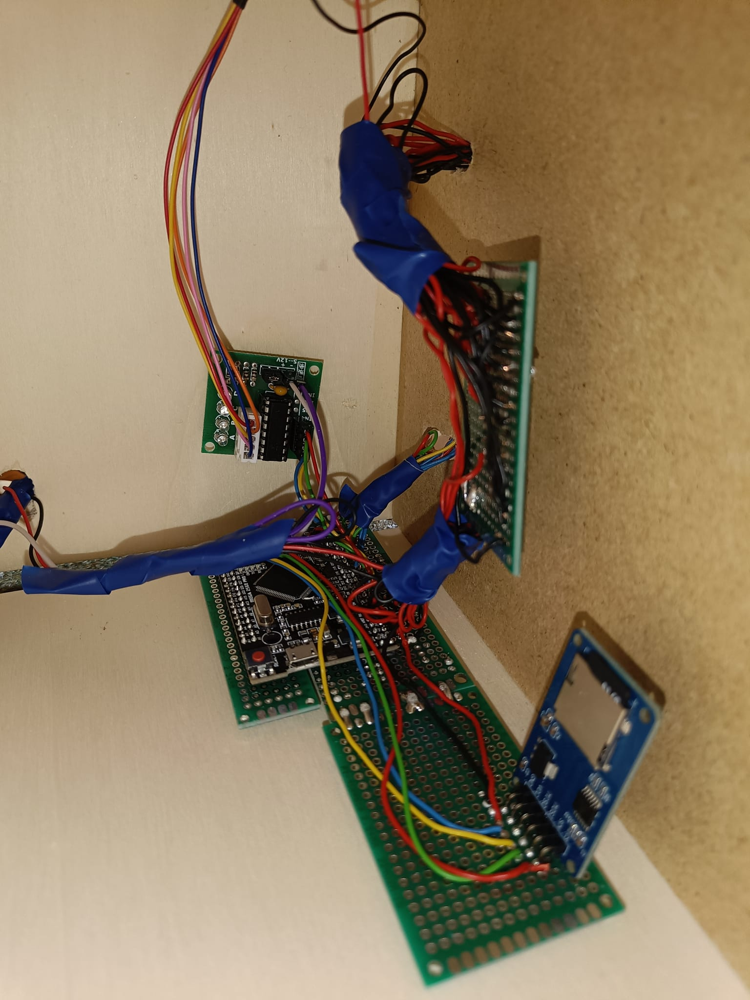

Solltet ihr ein Sparschwein zuhause haben und möchtet einen kurzen Zwischenstand über dessen Inhalt, könnt ihr entweder zählen oder baut einen solchen Münzzählautomaten nach, und zählt nie wieder.

## Materialliste

Teile:

- 5x Holzplatten 50x30
- 2x Pressspan 50x30
- 2x Lötplatinen
- 2x 10cm Kupferdraht
- 1x Holzleim
- 1x Heißkleber
- 1x Kugellager
- 1x 2 Komponenten Kleber

Hardware :

- 8x IR TCRT5000 Abstandssensoren
- 1x Schrittmotor 28BYJ-48 mit ULN2003 Treiberplatine
- 1x OLED Display SSD1306
- 1x Arduino Mega 2560

## Schritt 1 Vorbereitung:
Diese 3D Modelle müsst ihr slicen und drucken.                              
[Rampe_Getrennnt v5.stl](https://github.com/CptJannis/Data_SWH/blob/main/3D%20Druck/Rampe_Getrennt%20v5.stl)                                           
[Zahnrad v3.stl](https://github.com/CptJannis/Data_SWH/blob/main/3D%20Druck/Zahnrad%20v3.stl)                                           
[Kugellager_passend.stl](https://github.com/CptJannis/Data_SWH/blob/main/3D%20Druck/Kugellager_passend.stl)

Diese Schablonen müsst ihr Lasercutten oder optional per Hand sägen                                               
[Mototrplatte.png](https://github.com/CptJannis/Data_SWH/blob/main/Lasercut/Mototrplatte.png)                                                           
[Schieber Platte scaled.png](https://github.com/CptJannis/Data_SWH/blob/main/Lasercut/Schieber%20Platte%20scaled.png)                                                  
[Drehscheibe.png](https://github.com/CptJannis/Data_SWH/blob/main/Lasercut/Drehscheibe.png)

hier liegen alle Dateine zum Download bereit: https://github.com/CptJannis/Data_SWH

## Schritt 2 Mechanik Coinpusher:

1. Den Schraubenhalter in das Kugellager einsetzten.
2. Mit einer Gewindeschraube 5mm Durchmesser das große Zahnrad an dem Kugellager befestigen
3. Auf der Hauptplatte jeweils in jedem Eck vier 2mm Löcher bohren. 
4. Auf dem Rand der Runden Drehscheibe, ein 5mm Loch für die zweite Gewindeschraube bohren. 
5. Die kürzere Gewindeschraube an der Drehscheibe festschrauben.
6. Die Runde Drehscheibe auf der langen Schraube aufdrehen.                                                          (Muttern und Unterlegscheiben nicht vergessen)
7. Den Motor mit einem Heißkleber am vorgefertigtem Loch befestigen.
8. Kleines Zahnrad für den Motor aufstecken.
9. Die vier langen Schrauben an jedem Ecke festschrauben. Die Gewindeeinstätze auch.             (Die kleinen Schrauben können erst beim Einbau aufgeschraubt werden.
10. Bewegliche Platte an den Rändern zusägen, damit sie nicht mehr an den Standschrauben hängen bleibt.


Bild 1


Bild 2

# Schritt 3 Münzerkennung:

1. In die quadratische lasergecuttete Platte 17 Rillen einschneiden. Auf der gegenüberliegenden Seite das gleiche Spiel. Die Rillen haben eine Tiefe von 1mm.
2. Die beiden nicht isolierten Kupferdrähte um die Platte wickeln. Die Drähte dürfen sich auf keinen Fall berühren. 
3. Drähte kürzen und mit mit einem Kabel verlöten und abisolieren.

# Schritt 4 Gehäuse:

Für die Vorderwand und Hinterwand nehmen wir die Platten, wie sie sind. Die beiden Seiten Wände haben die Maße 20x30. Der Boden und die Decke muss auf die Maße 50x20 zugesägt werden. 

Nun brauchen wir noch Platten für das Innenleben.                                                             Die Platte auf der die Mechanik steht, hat die Maße: 15,5x27. 



Bild 3

Da es sein kann, dass die Holzplatten leicht gebogen sind, kann es vorkommen, dass die anzuleimende Platte Spalte zu den Wänden aufweist und somit irgendwo aufliegen muss, um fest verleimt werden zu können. Deshalb habe ich die kleinen Blöcke zurecht geschnitten und angeleimt.

Danach kann die Trennwand wie in Bild 4 angeleimt werden. Maße Trennwand: 22x30.


Bild 4

Die Rampe mit den Maßen 16x2,8, kann mit einem Winkel angeschraubt werden. Zuvor muss man mit etwas Gefühl sie von einem 90° Winkel ein 100° Winkel daraus machen. Die hinausstehenden Schrauben müssen danach aber mit einer Flex abgetrennt werden.                    Damit der Schieber nicht verrutscht, muss links und rechts davon ein kleiner Holzklotz angeschraubt werden.


Bild 5

Die beiden Teile für die Schiene müssen mit 2 Komponentenkleber zusammengeklebt werden. Das Ganze sollte über Nacht trocknen. Kleberreste, welche die Laufruhe der Münzen negativ beeinträchtigen können, müssen entfernt werden.


Bild 6

Die Rampe muss mit einem kleinen Abstand an der Außenwand befestigt werden, damit die Münze zuverlässig hinunterrollt und nicht stecken bleibt. 

Hinzu kommen zwei Dreiecke, welche rechts von der Schiene festgeklebt werden müssen. Von den Dreiecken werden insgesamt 4 benötigt. Die Maße sind hierbei 16cm Länge, die lange Außenseite ist 3,7cm lang und die kurze 1cm.

Die anderen zwei Dreiecke werden für den richtigen Winkel der Münzen benötigt. Die Dreiecke müssen den gleichen Winkel wie die Schiene haben (Bild 3). 

# Schritt 4 Abstandssensoren:

1. Aus dem Pressspan eine 10x31 Platte zurecht sägen.
2. 8 Löcher Bohren, welche direkt gegenüber der Löcher der Schiene liegen, über die die Münzen nach Größe sortiert werden.
3. Sensoren durch die Löcher stecken und festkleben.
4. (Beim Testen der Sensoren kann die kleine Schraube auf der Vorderseite benutzt werden. Sie ist für den Abstand zuständig, ab den die minimale Abstandserkennung ohne hinzuschalten der 5V des digital Pins möglich ist.) 



# Schritt 5 Code:

Zu Beginn müssen alle Bibliotheken, Pins und sonstige Variablen angegeben werden.

```jsx
#include <Adafruit_GFX.h>
#include <Adafruit_GrayOLED.h>
#include <Adafruit_SPITFT.h>
#include <Adafruit_SPITFT_Macros.h>
#include <gfxfont.h>

#include <Stepper.h>
#include <Wire.h>
#include "SSD1306Ascii.h"
#include "SSD1306AsciiWire.h"

#include <SPI.h>
#include <SD.h>

#define I2C_ADDRESS 0x3C
SSD1306AsciiWire oled;

int SPU = 2048; // Schritte pro Umdrehung.
Stepper Motor(SPU, 8,10,9,11); // Der Schrittmotor erhält die Bezeichnung "Motor" und es wird angegeben an welchen Pins der Motor angeschlossen ist.

// Pin für Muenzerkennung
int Metall = 5;

// Pin für SD Kartenlesegerät
const int chipSelect = 53;

// Variablen für die Nutzung der SD utility library Funktionen
Sd2Card card;
SdVolume volume;
SdFile root;

// Abstandssensoren
int SensorPin1 = 27;
int SensorPin2 = 26;
int SensorPin3 = 31;
int SensorPin4 = 25;
int SensorPin5 = 29;
int SensorPin6 = 30;
int SensorPin7 = 28;
int SensorPin8 = 24;

// Gesamtvermögen
double MoneyInBank;

// Um die Aktinonen des Motors und der Münzerkennung richtig zu timen
int Period = 1400;
int myTime;
int actualTime;

// Um sich zu merken welcher Abstandssensor ausgeschlöst hat
bool Pin1;
bool Pin2;
bool Pin3;
bool Pin4;
bool Pin5;
bool Pin6;
bool Pin7;
bool Pin8;

// File welche auf der SD Karte liegt
File bankFile;
```

Danach wird in dem Setup versucht eine SD Karte zu erkennen, auf der dann der Gesamtbetrag gespeichert werden soll. Da bei meinem SD Karten Modul keine der SD Karten richtig beschreiben oder von ihnen lesen konnte habe ich die Aktualisierung ausgelassen. 
Heißt die SD Karte wird erkannt und wäre bereit, beschrieben zu werden, wird sie aber in meinem Code nicht. Wenn ihr also nicht bei jedem Start der Maschine von 0 zählen wollt, sondern einen gespeicherten Stand abrufen möchtet, müsst ihr den Code erweitern.

```cpp
void setup() {
  pinMode(Metall, INPUT_PULLUP);
  pinMode(SensorPin1, INPUT);
  pinMode(SensorPin2, INPUT);
  pinMode(SensorPin3, INPUT);
  pinMode(SensorPin4, INPUT);
  pinMode(SensorPin5, INPUT);
  pinMode(SensorPin6, INPUT);
  pinMode(SensorPin7, INPUT);
  pinMode(SensorPin8, INPUT);
  Motor.setSpeed(16); //Motor-Geschwindigkeit
  Serial.begin(9600);

  // Initialisieren der SD Karte
   while (!Serial) {
    ; // wait for serial port to connect. Needed for native USB port only
  }
  Serial.print("\nInitializing SD card...");
   if (!card.init(SPI_HALF_SPEED, chipSelect)) {
    Serial.println("initialization failed. Things to check:");
    Serial.println("* is a card inserted?");
    Serial.println("* is your wiring correct?");
    Serial.println("* did you change the chipSelect pin to match your shield or module?");
    while (1);
  } else {
    Serial.println("Wiring is correct and a card is present.");
  }
  if (SD.exists("bankFile.txt")) {
    Serial.println("bankFile.txt exists.");
  } else {
    Serial.println("bankFile.txt doesn't exist.");
  }
  bankFile = SD.open("bankFile.txt", FILE_WRITE);
  // if the file opened okay, write to it:
  if (bankFile) {
    Serial.print("Writing to test.txt...");
    bankFile.println(MoneyInBank);
    // close the file:
    bankFile.close();
    Serial.println("done.");
  } else {
    // if the file didn't open, print an error:
    Serial.println("error opening bankFile.txt");
  }

  // OLED Display 
  Wire.begin();
  Wire.setClock(400000L);
  oled.begin(&Adafruit128x64, I2C_ADDRESS);
  oled.setFont(System5x7); // Auswahl der Schriftart
  oled.clear(); //Löschen der aktuellen Displayanzeige
  oled.println(" Aktueller Kontostand");
  oled.println(" ");
  oled.print(" ");
  oled.print(MoneyInBank);
  oled.print("€");
}
```

Nun muss geschaut werden, ob eine Münze erkannt wird. Danach schiebt der Motor den Schieber, wodurch die Münze herunterfällt und auf die Schiene rollt. Sobald die Münze rollt, darf der Motor nicht mehr drehen, da wir sonst nicht in die Loop kommen, in der die Sensoren Updates liefern. Deshalb gibt es den Timer in der While-loop. 

Schaut wie lange die zwei Euro Münze an Zeit braucht, um durch ihr Loch zu fallen und stellt, wenn nötig die Period Time neu ein.

```cpp
void loop() {
  // Bool um zu erkennen, ob Münze aufgelegt wurde
  bool MetallErkannt = digitalRead(Metall);

  if(!MetallErkannt){ 
    Motor.step(-1500);
    //Serial.println("Muenze erkannt!");
    myTime = millis();
    while((actualTime = millis() - myTime) < Period){
     // Auslesen aller Pins für die Zeit Period
      if(digitalRead(SensorPin1) == LOW){    
        Pin1 = true;
        Serial.println("Pin1");
        delay(5);
      }
      if(digitalRead(SensorPin2) == LOW){    
        Pin2 = true;
        Serial.println("Pin2");
        delay(5);
      } 
      if(digitalRead(SensorPin3) == LOW){    
        Pin3 = true;
        Serial.println("Pin3");
        delay(5);
      } 
      if(digitalRead(SensorPin4) == LOW){    
        Pin4 = true;
        Serial.println("Pin4");
        delay(5);
      } 
      if(digitalRead(SensorPin5) == LOW){    
        Pin5 = true;
        Serial.println("Pin5");
        delay(5);
      }     
      if(digitalRead(SensorPin6) == LOW){    
        Pin6 = true;
        Serial.println("Pin6");
        delay(5);
      } 
      if(digitalRead(SensorPin7) == LOW){    
        Pin7 = true;
        Serial.println("Pin7");
        delay(5);
      } 
      if(digitalRead(SensorPin8) == LOW){    
        Pin8 = true;
        Serial.println("Pin8");
        delay(5);
      }
    }  
    Motor.step(1500);
  }
```

Jetzt muss nur noch geprüft werden, welche Sensoren an waren und welche nicht. Dann kann das Vermögen und das Display geupdatet werden. 

Dreht beim Testen gerne an der Schraube und probiert etwas herum. Wenn eine Münze vorbei rollt, sollte die zweite LED aufblitzen (mehrmaliges aufblitzen ist auch in Ordnung).

Sollte bei euch die SD Karte laufen, könnt ihr in den jeweiligen if-Abfragen die Datei auf der SD Karte aktualisieren.

Es ist möglich, dass euer OLED-Display das € Zeichen nicht darstellen kann.

```cpp
/////////////////////////////////////////////////////////////
  /*  Erkennung durch welchen Münzslot die Münze fällt.
      Da beim vorbei rollen alle Sensoren die Münze erkennen, 
      muss der letzte positive Sensor gefunden werden. 
      Wenn ein Sensor eine Münze erkannt hat und der 
      dahinterliegende Sensore keine Münze erkannt hat,
      muss die Münze durch den vorhereigen Slot gefallen sein.
  */

  if(Pin1 && !Pin2){
    MoneyInBank += 0.01;
    Serial.println("0.01");
    delay(500);
    oled.clear(); 
    oled.println(" Aktueller Kontostand"); 
    oled.println(" ");
    oled.print(" ");
    oled.print(MoneyInBank); 
    oled.print("€");
  }
  if(Pin2 && !Pin3){
    MoneyInBank += 0.02;
    Serial.println("0.02");
    delay(500);
    oled.clear(); 
    oled.println(" Aktueller Kontostand"); 
    oled.println(" ");
    oled.print(" ");
    oled.print(MoneyInBank); 
    oled.print("€");
  }
  if(Pin3 && !Pin4){
    MoneyInBank += 0.1;
   Serial.println("10");
    delay(500);
    oled.clear(); 
    oled.println(" Aktueller Kontostand"); 
    oled.println(" ");
    oled.print(" ");
    oled.print(MoneyInBank); 
    oled.print("€");
  }
  if(Pin4 && !Pin5){
    MoneyInBank += 0.5;
    Serial.println("5");
    delay(500);
    oled.clear(); 
    oled.println(" Aktueller Kontostand"); 
    oled.println(" ");
    oled.print(" ");
    oled.print(MoneyInBank); 
    oled.print("€");
  }
  if(Pin5 && !Pin6){
    MoneyInBank += 0.2;
    Serial.println("20");
    delay(500);
    oled.clear(); 
    oled.println(" Aktueller Kontostand"); 
    oled.println(" ");
    oled.print(" ");
    oled.print(MoneyInBank); 
    oled.print("€");
  }
  if(Pin6 && !Pin7){
    MoneyInBank += 1;
    Serial.println("100");
    delay(500);
    oled.clear(); 
    oled.println(" Aktueller Kontostand"); 
    oled.println(" ");
    oled.print(" ");
    oled.print(MoneyInBank); 
    oled.print("€");
  }
  if(Pin7 && !Pin8){
    MoneyInBank += 0.5;
    Serial.println("50");
    delay(500);
    oled.clear(); 
    oled.println(" Aktueller Kontostand"); 
    oled.println(" ");
    oled.print(" ");
    oled.print(MoneyInBank); 
    oled.print("€");
  }
    if(Pin8){
    MoneyInBank += 2;
    Serial.println("200");
    delay(500);
    oled.clear(); 
    oled.println(" Aktueller Kontostand"); 
    oled.println(" ");
    oled.print(" ");
    oled.print(MoneyInBank); 
    oled.print("€");
  }
  // Setze bools zurück, um die nächste Münze richtig zu erkennen
  Pin1 = false;
  Pin2 = false;
  Pin3 = false;
  Pin4 = false;
  Pin5 = false;
  Pin6 = false;
  Pin7 = false;
  Pin8 = false;
```

Sobald alle Sensoren richtig funktionieren, kann es mit dem Löten los gehen!

# Schritt 6 Löten:



Lötet alle Pins nach diesem Plan an. Für die Münzerkennung muss einer der Drahte mit GRND verbunden sein und der anderer mit Pin 5.

Alle - Pole (GRND) können in einer Reihe auf einer Platine festgelötet werden.
Alle + Pole (5V) können in einer Reihe auf einer Platine festgelötet werden.




Einen Schönheitspreis gewinnt es nicht, aber es funktioniert. Sollten manche Sensoren nicht funktionieren, könnt ihr versuchen eine Weitere Stromquelle anzuschließen. Ich habe ein normales Micro-USB Kabel aufgeschnitten und an ein Schalter gelötet. 
Dann hab ich ein 5V-9V Netzteil von meinen Handy genommen und es daran angeschlossen. 
Dadurch hat sich das Problem bei mir behoben. 

# Schritt 7 Zusammenbauen:

1. Einsetzten der Platte mit den Sensoren. (Am besten in einem leichten Winkel. Sensoren sollen leicht nach oben zeigennd und sich auf Höhe der Löcher in der Schiene befinden.
2. Boden anleimen.
3. Platinen anschrauben oder ankleben.
4. Kabel abisolieren und aufräumen.
5. Deckel anleimen.
6. Tür mit zwei Scharnieren anschrauben (linke Seite), sodass die Schiene sauber abschließt mit der vorherigen Rampe.

# Schritt 8 Sparen:

Nun kommt der leichteste und vielleicht auch der schwierigste Teil. Schmeißt eure Münzen auf die Platte und staut darüber, was ihr gebaut habt!