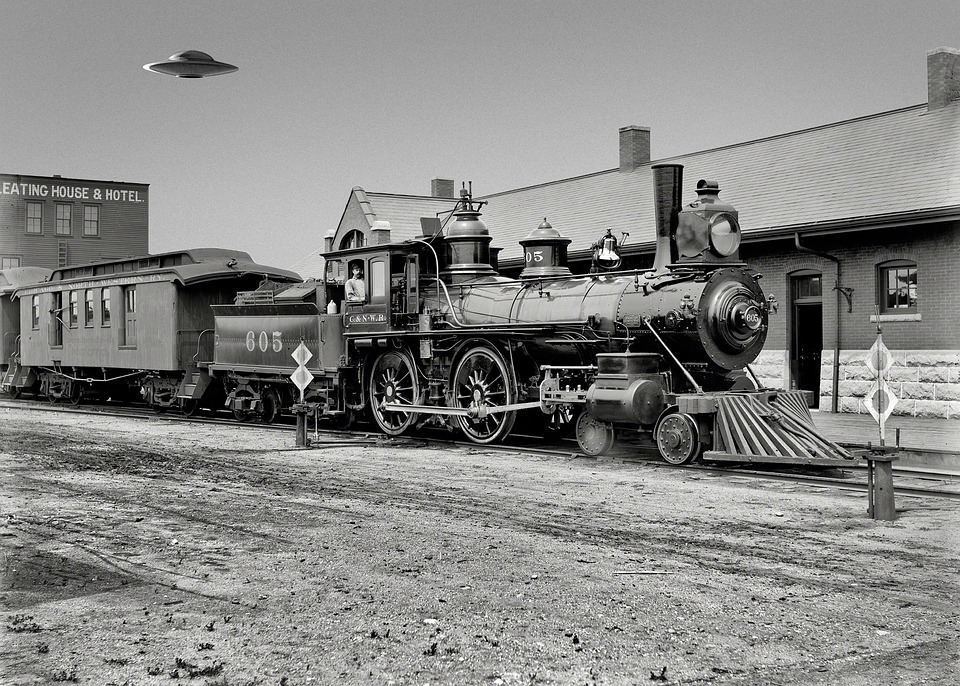

Da ich krankheitsbedingt die Vorlesung zum Mechanik-Modul verpasst habe, gibt es diesmal keine Bilder von mit Fischer-Technik gebauten Mechanikmeisterwerken :(.

Trotzdem sind mir in meinem Alltag Mechaniken aufgefallen, die einige Prinzipien aus den Vorlesungsfolien verwenden.
Das Beispiel, welches ich wähle, ist ein klassisches Mechanikbeispiel.
Zwar saß ich in einer Straßenbahn und in keiner Dampflok, bei denen sich im Vergleich die Mechaniken der Antriebe drastisch geändert haben, finde ich, eine Dampf-Maschine /-Lok ist immer noch ein perfektes klassisches Beispiel der Mechanik.

https://pixabay.com/de/photos/dampflokomotive-anachronismus-502111/

Der Kolben der Dampfmaschine ist mittels einer Stange welche davor und danach eine Gelenk besitzen am Rad verbunden.
Diese Verbindung wird `Linkages` genannt.

https://www.bretagne-tip.de/geschichte/dampfmaschine.php

Die Dampfmaschine wandelt Wärmenergie in Bewegungsenergie um.

