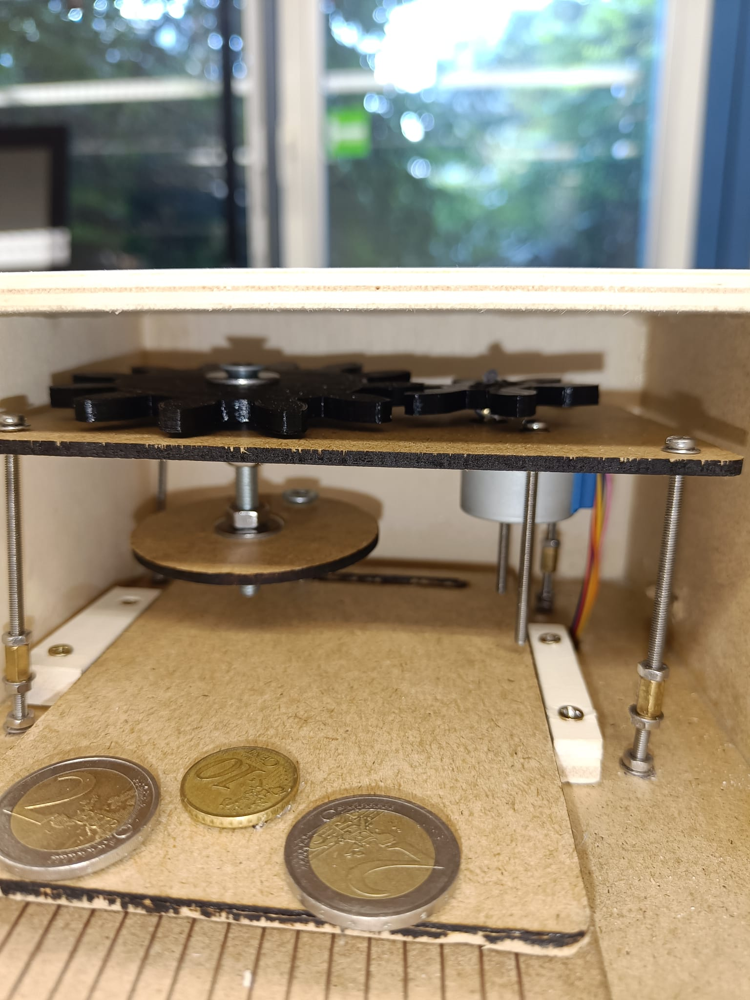
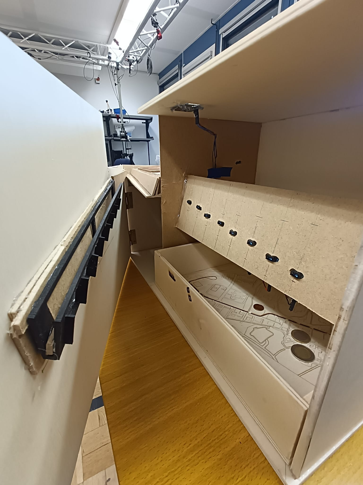

## Projektverlauf
Zu Beginn hatte ich nicht vor Augen, wie die Maschine im Gesamten funktionieren soll. 
Der Aufbau war dabei das größte Problem. Wo lege ich die Münze darauf, wie fliegt sie in die Sortierschiene, wie sind die Maße. 
All das habe ich erst im Laufe des Projekts klären können. Teils habe ich einfach improvisiert.
Technisch gesehen hatte ich dabei kein Problem. Ich wusste, wie die Sensoren funktionieren und hatte somit kein Problem, mir den Aufbau zu überlegen, um die Münzen korrekt zu erkennen.

Letztendlich war ich ziemlich überrascht, wie gut alles funktioniert hat. Bis auf die SD-Karte funktioniert der Automat reibungslos. Einziges Manko ist, dass die Münzen teils falsch erkannt werden, was aber am Code liegt.

## Tools
Auch wenn ich nur zwei Zahnräder 3D-Modelliert habe, hatte ich dabei deutlich mehr Spaß als Schablonen für den Lasercut zu erstellen. Ich habe gelernt, mit Fusion umzugehen und es war mir nicht mehr fremd. Die Bedienung lief deutlich flüssiger und schneller, als zu Beginn des ersten Semesters, wodurch es Spaß gemacht hat, damit zu arbeiten.
Am meisten gefiel mir aber das Schreinern des Gehäuses. Abmessen, Sägen, Schrauben und verleimen war wie meditieren. 

## Motivation
Durch den Kurs und vor allem durch das Projekt habe ich gelernt Projekte richtig anzufangen. 
Sich einen groben Überblick verschaffen, Ideen sammeln, Skizzen erstellen und sich in erster Linie in das Projekt eindenken. Insgesamt bin ich selbstständiger  geworden und habe Lust bekommen, selber Projekte anzupacken. Aber erst mal nur softwareseitige Projekte.

Durch die 100% an Praxis hat man sehr viel mehr für das spätere Berufsleben gelernt als in fast allen Theoretischen Fächern. 
Und sollte ich später in meinem Beruf doch merken, dass ich mit doch unzufrieden bin mit der Arbeit als Informatiker habe ich einen Plan B mit einer Schreinerlehre *Zwinkersmiley*** 

## Wünsche
Für nächstes Semester würde ich mir mehr Zeit für die Projekte wünschen. Sechs Wochen waren doch recht knapp bemessen.

## Projektidee
Für mein Projekt im zweiten Teil von Sketching with Hardware hatte ich relativ schnell eine Idee. 

Ich brauchte in meinem Alltag nur etwas aufmerksamer sein und schon stieß ich auf mein erstes Problem. Diesen Sommer möchte ich nach langer Zeit mal wieder in den Urlaub fahren und dafür habe ich schon einiges an Kleingeld angespart. Also öffnete ich den kleinen Gummiverschluss auf der Unterseite meiner Spardose und friemelte mühevoll alle Münzen raus. Allein dies hat mich mindestens zehn Minuten meiner Lebenszeit gekostet. Nachdem das Geld aber draußen war, musste ich es natürlich auch noch zählen. Und genau an diesem Moment kam mir die Idee diesen Vorgang zu automatisieren. 

Es war an der Zeit einen voll automatischen Münzzählautomaten zu bauen. 

Münzzähler können physisch oder optisch arbeiten. Dabei wollte ich lieber mittels physischer Mittel arbeiten, da ich mir die Programmierung für eine optische Erkennung nicht zugetraut habe. 

Ebenso wollte ich nicht nur ein Schlitz für den Münzeinwurf haben, sondern es sollte etwas kreativer sein. Dabei kam ich auf die Idee die Mechanik eines Coinpushers zu verwenden, um die Münze in die Sortiervorrichtung zu befördern.

## Projektstand

Hier ist der Aufbau des Autoamten zu sehen. 
Wie zu sehen erkennt der Automat die Münze problemlos und zählt den Aktuellen Geldstand korrekt mit.

Die Platte, welche zur Erkennung der Münze zuständig ist, hat einen Draht, welcher an den Minus-Pol angeschlossen ist und einen Draht, welcher an einen Plus-Pol angeschlossen ist.
Nachdem die Münze auf die Platte mit den Drähten gelegt wurde, hat sich dadurch ein Stromkreis geschlossen. Dies wurde am angeschlossenen Pin (Plus-Pol) erkannt.     Nun fängt sich ein Schrittmotor an zu drehen, und bewegt eine Platte, welche die Münze zum fallen bringt. 

Sobald die Münze zu rollen beginnt, messen 8 Abstandssensoren im inneren permanent Abstände. Sobald eine Münze an einem solchen Sensor vorbei rollt, misst dieser einen geringeren Abstand als zuvor, woraus für das Programm folgt, dass an diesem Sensor eine Münze vorbei gerollt ist. 

Der letzte Sensor, der positiv ausgelöst hat ist liegt hinter dem Loch durch Welchses die Münze gefallen ist. Da jedes Loch nur genau so groß ist wie die Münze selbst, können nur die Münze mit entsprechenden Wert durch dieses Loch.

Durch diese Information wissen wir den Wert der eingeschmissenen Münze und dieser kann auf unseren Kontostand addiert werden. 

Dieser Kontostand wird dann auf dem OLED-Display ausgegeben.