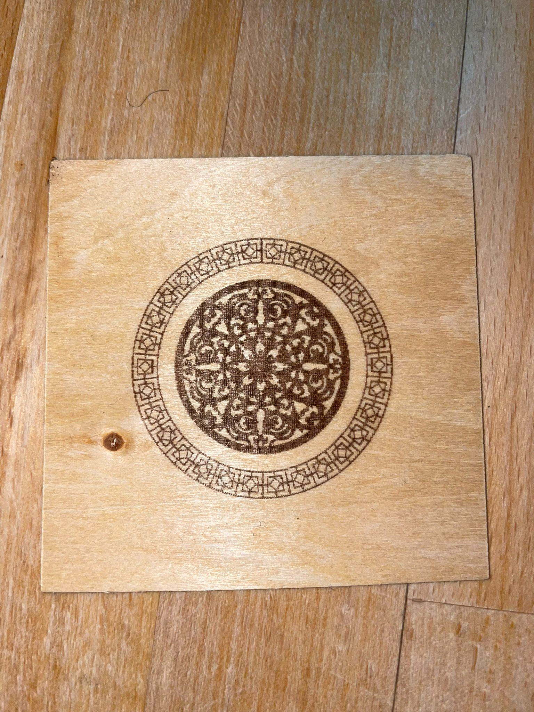

Die `subtraktive Fertigung` ist eine Art der Herstellung von Werkstücken, bei der Material abgetragen wird, um die gewünschte Form und Größe zu erreichen. Im Gegensatz dazu wird bei der `additiven Fertigung` Material hinzugefügt, um das Werkstück aufzubauen.

Einige Beispiele für Maschinen, die in der subtraktiven Fertigung verwendet werden, sind Fräsmaschinen, Lasercutter und Schleifmaschinen. Diese Maschinen können eine Vielzahl von Materialien verarbeiten, darunter Metall, Holz, Kunststoff und sogar Keramik.
Einer der Vorteile der subtraktiven Fertigung ist, dass sie sehr präzise und genau ist und auch komplexe geometrische Formen erzeugen kann.

Im Lab können Materialien wie Holz, Kunststoffe, Papier und Karton verarbeitet werden. Die CNC-Fräse könnte in der Theorie auch Metall berarbeiten, wird aber nicht gemacht. Materialien die auf **gar keinen Fall** in den Lasercutter gehören, sind beispielsweise PVC, Kunstleder, Farben und Lackschichten, da diese giftige Dämpfe absondern.
Ebenso sollten leicht entflammbare Materialien nicht im Lasercutter berarbeitet werden. Generell soll der gesamte Vorgang beobachtet werden, falls der seltene aber mögliche Fall auftritt, dass das zu bearbeitende Material Feuer fängt.

Der erste Schritt für die Planung meines Projektes bestand in der Materialwahl. Da 3D Druck zu lange dauern würde für die gesamte Karosserie, habe ich mich für Holz entschieden. Die einzelnen Teile werden von dem Lasercutten zurecht geschnitten und miteinander verklebt, oder
gesteckt.

Hier sind meine ersten Sketches und Ideen.

Die Lenkung sollte einer Autolenkung nachempfunden sein, aber für
diese zu modellieren ist zu zeitaufwendig, weshalb ich einfach eine 
Starre Achse bewegen werde.
Die Achsen und auch sonstige beweglichen Teile, werde ich in Fusion 
modellieren und 3D drucken. Dazu aber mehr im Abschnitt "Additive Fertigung"

Abschließend haben wir selber einen 5 auf 5 Centimeter großen Entwurf cutten dürfen. 
Hier mein Ergebnis:

